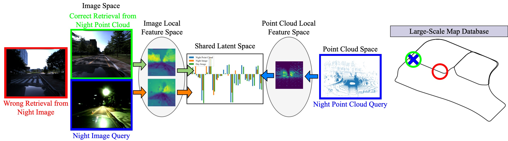
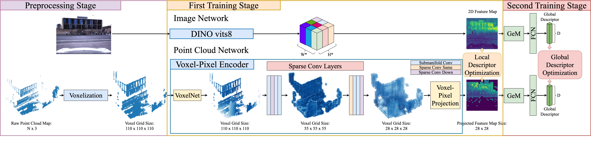

# VXP: Voxel-Cross-Pixel Large-scale Image-LiDAR Place Recognition

We propose a novel Voxel-Cross-Pixel (VXP) approach, which establishes voxel and pixel correspondences in a self-supervised manner and brings them into a shared feature space. We achieve state-of-the-art performance in cross-modal retrieval on the Oxford RobotCar, ViViD++ datasets and KITTI benchmark, while maintaining high uni-modal global localization accuracy.



## Setup the environement

```
git clone https://github.com/yunjinli/vxp.git
cd vxp
conda create -n VXP python=3.10 -y
conda activate VXP
pip install torch torchvision numpy pandas tqdm tensorboard psutil scikit-learn bitarray pytorch-metric-learning==0.9.94 torchinfo
pip install -U openmim
mim install mmengine 'mmcv>=2.0.0rc4' 'mmdet>=3.0.0' 'mmdet3d>=1.1.0'
pip install 'git+https://github.com/facebookresearch/detectron2.git'
```

For sparse 3D convolution, we're using spconv library. You can follow the detailed installation guide on their [repository](https://github.com/traveller59/spconv). Or you can simply run the following command with specific cuda version (I'm using CUDA 12.0).

```
pip install spconv-cu120
```

## Dataset Format / Creation

Please see [here](./docs/dataset_format.md).

## Training

Please see [here](./docs/training.md).

## Inference

Please see [here](./docs/inference.md).
